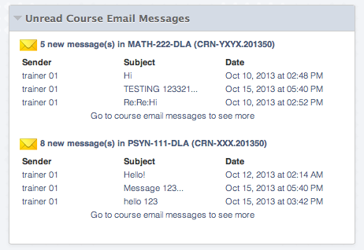

BBUnreadMessages
================

Blackboard Building Block Module for Unread Course Messages Notification

- Show number of unread messages
- Show up to three unread messages (sender/subject/date sent)
- Show all available course on Institutional page
- Show only current course messages in a course context
- Show a link to Inbox if more than three unread messages exist
- Clicking on course / number of unread messages takes to course's Inbox
- Clicking on messages opens the message
- Show an icon next to a course with unread messages
- Does NOT show messages in unavailable courses
